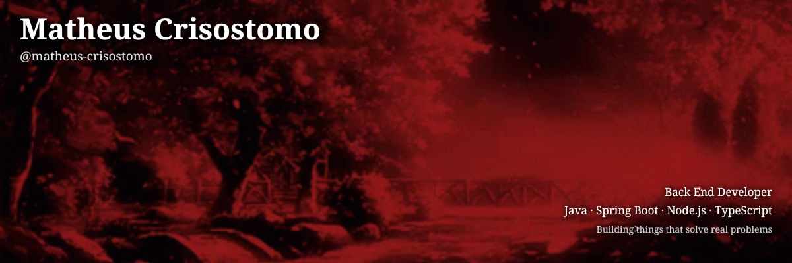

  

---

##  Sobre Mim

-  Comecei a jornada com Desenvolvimento de Software em **Java / Spring Boot**
-  Desenvolvedor Back End apaixonado por criar soluções eficientes e escaláveis
-  Atualmente cursando Sistemas de Informação
-  Pratico com **n8n**, **automação** e **integrações de API**
-  Áreas principais: **Java, Spring Boot, Node.js, TypeScript**
-  Gosto de construir coisas que resolvem problemas reais

  
  
   
   
  

---

##  Linguagens e Ferramentas em que Já Coloquei as Mãos

### Backend

### Frontend

### Banco de Dados & Ferramentas

---

##  Estatísticas do GitHub

  
  

 

  

---

##  Projetos em Destaque

  
  
  

---

##  Conecte-se Comigo

---

<!-- Gráfico de Atividade -->

  

<!-- Animação da Cobra -->

  

<!-- Rodapé -->

